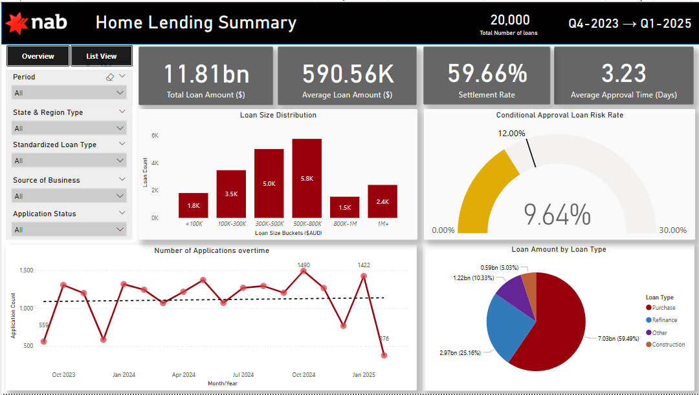

# 🏡 Mortgage Analytics Project (dbt + Databricks)

This project demonstrates a complete, production-style data transformation pipeline using **dbt Cloud** and **Databricks**, with a Power BI dashboard as the final business deliverable. The aim was to replicate a real-world analytics engineering workflow — from raw data ingestion, transformation, and testing, to dashboarding and insights delivery.
---

## 🚀 Tools Used

- **Databricks SQL Warehouse** – Cloud-based compute and data storage
- **dbt Cloud** – Transformation, testing, documentation, modular SQL
- **Power BI** – Dashboard and business-facing analytics
- **GitHub** – Version control and portfolio hosting

---

## 📊 Power BI Dashboard

The dashboard visualizes key mortgage KPIs sourced from the dbt-transformed tables in Databricks.

It includes:

- Total + average loan amounts
- Settlement vs withdrawal rates
- Loan distribution by size, region, and type
- Approval timelines
- Conditional approval risk bands

📸 Preview:



---

## 🧠 What I Learned (and struggled through)

- 📡 **Connecting dbt to Databricks**: Setting up tokens, profiles.yml, catalogs (`workspace` vs `main`), and schema access was non-trivial. I ran into multiple `NO_SUCH_CATALOG_EXCEPTION` and connection hangs — and learned how to debug them using Databricks SQL Explorer and proper config formatting.
- ⚙️ **Understanding dbt’s flow**: Realized how `sources`, `staging`, and `marts` fit together conceptually and in code.
- 🧪 **Writing modular, tested SQL**: dbt encouraged me to split raw data cleaning into clean staging models before aggregating for final reporting.
- 🔁 **Iteration**: I rebuilt my project from scratch after hitting the dbt Cloud free project limit — this helped solidify my understanding of every part of the pipeline.

---
## 🧱 Project Setup & What I Built

This project was created entirely in **dbt Cloud**, connected to a **Databricks SQL Warehouse**, with the following key files and configurations:

### 🔌 dbt → Databricks Connection

Connecting dbt to Databricks involved setting up:

- A **Databricks SQL Warehouse** using the Community Edition
- A **personal access token** from Databricks
- A `profiles.yml` file in dbt Cloud that contained:
  - `host` (your Databricks workspace URL)
  - `http_path` (from the SQL Warehouse settings)
  - `token` (for authentication)
  - `catalog` and `schema` (`workspace.mortgage_analytics`)
  
I initially encountered errors such as:

- `NO_SUCH_CATALOG_EXCEPTION`
- Hanging connections when running `dbt run`
- Confusion around `workspace` vs `main` vs `hive_metastore`

These were resolved by:
- Choosing the right **catalog**: `workspace` (since `main` didn’t exist in my account)
- Creating a **schema** manually in Databricks (`mortgage_analytics`)
- Matching the `profiles.yml` to my SQL warehouse settings

---

### 📄 Key Files I Created

| File Name                      | Purpose                                                  |
|-------------------------------|----------------------------------------------------------|
| `src_mortgage_data.yml`       | Declares the raw Databricks table as a dbt **source** and applies **tests** (e.g. not_null, unique) on key fields like `application_submission_id` |
| `stg_mortgage_data.sql`       | Cleans the raw mortgage data: casting types, normalizing fields, formatting dates, removing inconsistencies — creates a staging layer for analysis |
| `mortgage_metrics.sql`        | Aggregates the staging data to generate KPIs like average loan amount, settlement rate, conditional approval rate, loan counts by type and state |
| `mortgage_metrics.yml` *(optional)* | Provides docs/tests for the final model (e.g. not null on numeric KPIs, column descriptions for Power BI users) |
| `dbt_project.yml`             | Core dbt config that defines model folders and build behavior |

Each file plays a role in building **modular, testable, and reusable** SQL models that layer from raw → clean → business metrics.


## 📦 Project Structure

```text
dbt-mortgage-analytics/
├── models/
│   ├── staging/
│   │   ├── src_mortgage_data.yml       # Source config + field-level tests
│   │   └── stg_mortgage_data.sql       # Casts, cleans, standardizes raw data
│   └── marts/
│       └── mortgage_metrics.sql        # Business-facing KPIs & aggregations
├── dbt_project.yml                     # Core dbt config (name, paths, etc.)
└── README.md                           # This file
